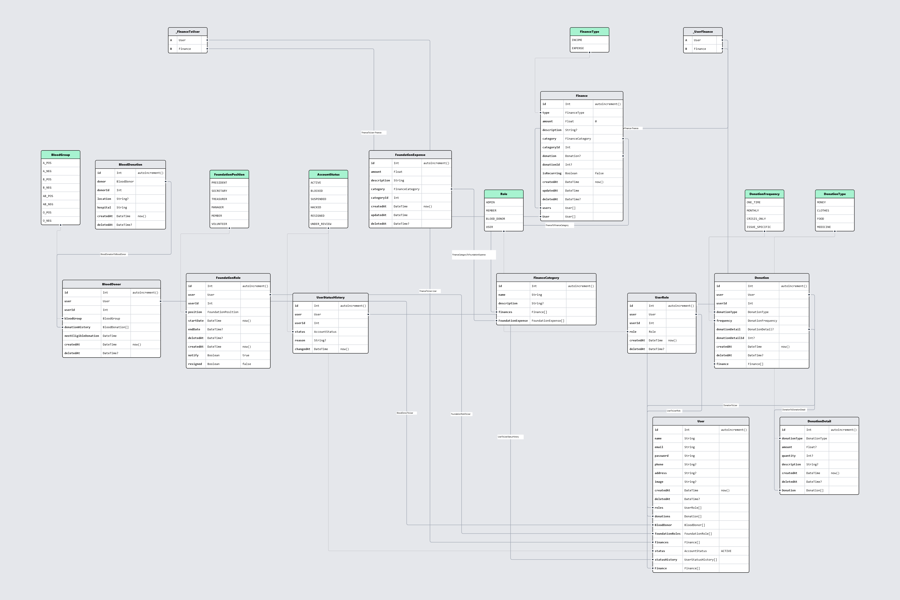

# 🎉 Youth Foundation Management System 🎉

## 🚀 Overview

Welcome to the **Foundation Management System**, a robust web application tailored for managing foundation activities seamlessly. Designed for scalability and efficiency, this system empowers foundations to optimize their operations, manage donations, and communicate effectively with stakeholders.
## Architecture Diagram

Below is the architecture diagram for the Youth Foundation project:

## 🌟 Key Features

- **User Management**: 
  - **Role-Based Access Control**: Efficiently manage users with different roles such as Admin, Member, Blood Donor, and Foundation Role Holders.

- **Donation Tracking**: 
  - **Comprehensive Donation Management**: Easily record, manage, and monitor various types of donations, with support for recurring donations.

- **Financial Management**: 
  - **Income & Expense Tracking**: Gain insights into the foundation's financial health, and generate and send monthly financial statements effortlessly.

- **Block & Resignation System**: 
  - **User Status Management**: Temporarily block users based on resignation, inactivity, or account-related issues to maintain operational integrity.

- **Automated Notifications**: 
  - **Monthly Statements**: Automatically send detailed donation and financial summaries via SMS and email to foundation role holders, ensuring they stay informed.

## 🛠️ Tech Stack

This project leverages modern technologies to ensure robustness and scalability:

- **Backend**: 
  - Node.js, Express.js
- **Database**: 
  - PostgreSQL
- **ORM**: 
  - Prisma
- **SMS Notifications**: 
  - Twilio
- **Email Notifications**: 
  - Nodemailer or SMTP service

## 📊 Database Schema

The database architecture is designed for efficiency and clarity:

- **User**: Centralized user data management including roles and contact information.
- **Donation**: Comprehensive tracking of donation types, amounts, and frequencies.
- **Finance**: Detailed management of income and expenses along with relevant records.
- **Block Status**: Implement user blocking based on various statuses.
- **Foundation Role Holder**: Manage specific roles within the foundation effectively.

## ✉️ Monthly Notifications

Stay ahead with our automated monthly notifications:

- **Donation Statements**: Detailed records of all donations received during the month.
- **Financial Summaries**: An overview of monthly income and expenses to keep stakeholders informed.

## 📦 Deployment

### Production Deployment

To deploy this application in a production environment, follow industry best practices for setting up a secure PostgreSQL database, configuring your server, and utilizing cloud services like AWS or Heroku for deployment.

## 🤝 Contributing

While this project is tailored for single-developer use, contributions are always welcome! If you have suggestions or improvements, please follow these steps:

1. **Fork the repository**.
2. **Create a feature branch**.
3. **Submit a pull request** with a detailed explanation of your changes.

## 📜 License

This project is licensed under the MIT License. See the [LICENSE](LICENSE) file for details.

## 📞 Contact

For inquiries, feedback, or collaboration opportunities, feel free to reach out:

**Mehedi Imun**  
Email: [mehediimun@gmail.com](mailto:mehediimun@gmail.com)

---

### 🚀 Join Us on This Journey!

Thank you for considering the **Youth Foundation Management System**! Together, we can create a more efficient and impactful foundation experience.
